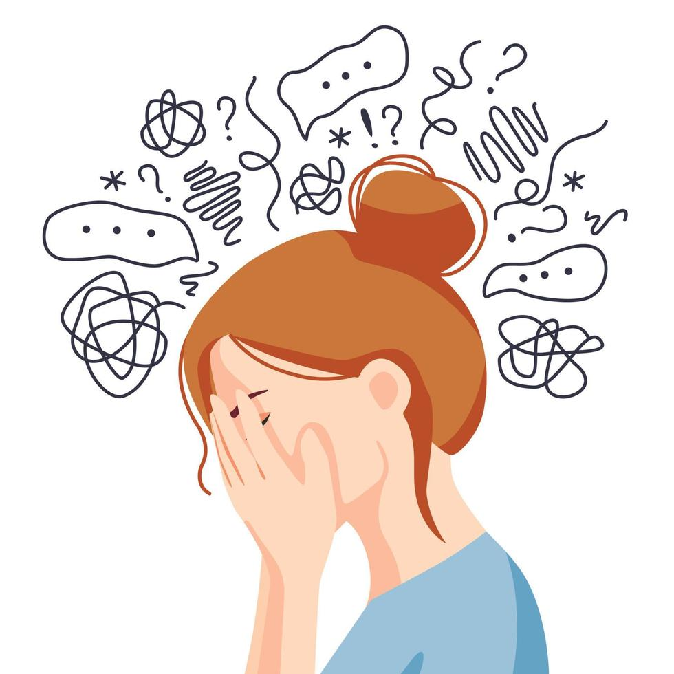

# Christine-Li_yuli0586
Creative coding major project_Individual Task
* **Name: Christine Li (Yuanshan Li)**
* **Unikey: yuli0586**

## *Rhythm of Fear*

## 1. How to interact with the work

After the page loads you will see four yellow buttons at the top: **Level 1 / Level 2 / Level 3 / Level 4**.
Click any button, wait a second, and the matching fragment of *Vivaldi – The Four Seasons: Winter* will loop. While the music plays, the background erupts into an audio-reactive animation whose intensity grows from Level 1 to Level 4. You can switch levels at any moment; the previous track stops instantly and its visual layer is replaced. The screaming character always stays in front so the focus is clear.

## 2. My individual approach to animating the group code

I chose **audio** (p5.FFT) to drive every motion. My responsibility inside the group was the large *lake & land* layer, but early tests that animated only that region felt too subtle. I therefore expanded the visualiser so it now fills the entire background, leaving the main character unmoved in front. Each level is realised with a distinct algorithm that mirrors a rising panic curve:

* **Level 1** – a single sine line with breathing dots: ordered thoughts just starting to quiver.
* **Level 2** – the line disintegrates into tidy dot columns that wobble faster when the music gets louder.
* **Level 3** – thousands of drifting particles flash in two colour layers, suggesting fractured thinking.
* **Level 4** – every grid cell spins and flips between circle and rounded square, a visual “meltdown”.

This full-screen, strongly audio-centric approach is different from my team-mates’ approaches.

## 3. Inspirations and their influence

Two classic visual elements shaped the design:

### (a) Tangled-scribble diagram – “inner noise”

The first reference (the girl hiding her face, encircled by messy doodles) expresses *cognitive overload* rather than outright panic. Those spaghetti-lines are thin, continuous, and still loosely organised; they look like hurried thoughts looping in place.

* **Level 1** therefore keeps a *single continuous sine wave* that rolls calmly across the screen. Dots grow and shrink along the line to hint at rising tension, mirroring the tiny chat bubbles in the picture.
* **Level 2** preserves the vertical rhythm of the scribbles but breaks the line into *neat dot columns*. This echoes the moment when thoughts “splinter” yet still obey an underlying beat. The columns sway sideways following two sine phases, like the illustration’s lines, which bend but do not explode.

### (b) Pop-art shock panel – “external blast”  

The second inspiration image shows a man in a classic comic-book *jump scare*: an explosion effect behind him, red halftone dots everywhere. It screams sudden, public, uncontrollable fear. I extracted two components:

1. **Radial explosion** -> everything must spin or radiate from screen-centre.
2. **Dense halftone dots** -> small units should multiply until the picture feels crowded.

* **Level 3** scatters *thousands of particles* that flash in two alternating palettes (foreground/background) to recreate the vibrating dotted texture. The dots drift but are confined to a flow-field, order hanging by a thread.
* **Level 4** aims for the absolute burst: each grid cell continuously rotates and morphs between *circle* and *rounded square*. The square is a “broken” circle, a blunt metaphor for thought patterns shattering. Random palette picks and size-twitches mimic the posterised colours of pop art, while global rotation references the explosion’s spinning energy.

## 4. Technical notes – audio visualiser  

The whole soundtrack is split into four files (`part1.mp3 – part4.mp3`), each one mapped to a **Level** button.
In `preload()` every file is loaded and given its own `p5.FFT` analyser so their spectra never interfere.
When the user clicks a button the chosen clip starts looping, any other clip is stopped immediately, and a flag `activeLevel` tells `draw()` which `drawLxVisualiser()` routine to run.
Inside each routine the current frame’s spectrum is reduced to one or two energy bands (`getEnergy('mid')` and / or `getEnergy('bass')`).
That 0-255 number is then scaled with `map()` and sent straight into size, position, strokeWeight and colour decisions.

### Level-by-level behaviour  

* **Level 1** keeps a single sine ribbon across the screen.
The mid-band energy decides three things at once:
1. how far the ribbon rises above or below the centre line;
2. how quickly the phase scrolls from right to left;
3. which colour is picked from the lake-&-land palette.
Tiny circles are drawn on every 40 px segment and their diameters breathe with exactly the same mapped value, so picture and audio feel locked together.

* **Level 2** replaces the ribbon with evenly-spaced dot columns that cover the full canvas width.
Side-to-side wobble is produced by two phase-shifted sine waves; I removed the Perlin-based `noiseRatio` that the reference sketch used because this project is not about Perlin noise.  
A new factor called `tempoFactor`, also derived from the mid-band energy, accelerates both sines when the music grows louder, while the vertical swing range was enlarged to 170 % of the original so strong beats make the dots fly further.

* **Level 3** scatters 2200 particles over a very gentle flow field.
I kept the Perlin-driven field from OpenProcessing 1725734 for the drifting motion, but replaced the hue-shifting colour logic with a direct lookup into `colPalette`.
The image is rendered in two passes: first all particles coloured by bass energy, then another pass coloured by mid energy, producing a foreground/background flicker that feels like thought fragments colliding.

* **Level 4** is the visual “meltdown”.
The canvas is tiled into a square grid whose cell size `eSize` is randomly re-rolled every two seconds; that sudden density change mimics panic spikes.
Each cell rotates by an amount extracted from its local FFT bin and continuously morphs between three shapes—wireframe circle, filled circle, and rounded square—according to the current mid-band energy bucket.
Removing the extra stroked square layer that existed in the reference sketch lightened the scene visually and increased frame-rate headroom.

### External code reference

* The sine-wave scaffold comes from [OpenProcessing 728232](https://openprocessing.org/sketch/728232)
* The dot-column idea from [OpenProcessing 967789](https://openprocessing.org/sketch/967789)
* The particle flow from [OpenProcessing 1725734](https://openprocessing.org/sketch/1725734)
* The spinning-grid concept from [OpenProcessing 2237575](https://openprocessing.org/sketch/2237575/)

In every case I kept only the geometric skeleton; all audio binding, colour selection and most parameter mappings were rewritten so the four levels form a clear, escalating narrative that matches Vivaldi’s *Winter* excerpt and the color palette of lake & land.

### Edits to the shared code-base

* Added `noStroke()` around the character’s nostrils to stop the outline colour flickering once the audio visualiser began driving global stroke settings.
* Drew the **ghost character** before the four visualiser layers, so the new background effects can sit on top without obscuring the screaming figure.
* Used spaces = [200, 160, 110] in my individual version (vs. group’s 200, 160, 120) to enhance yellow visibility at Level 4.